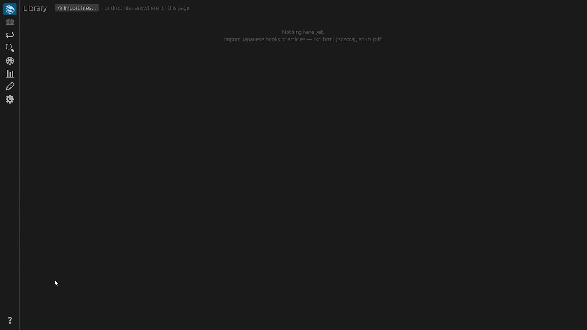
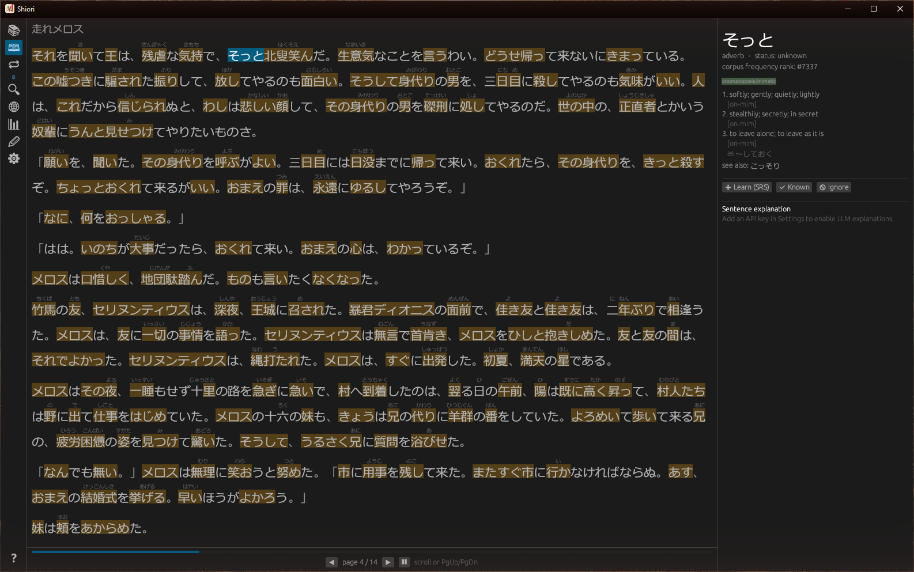
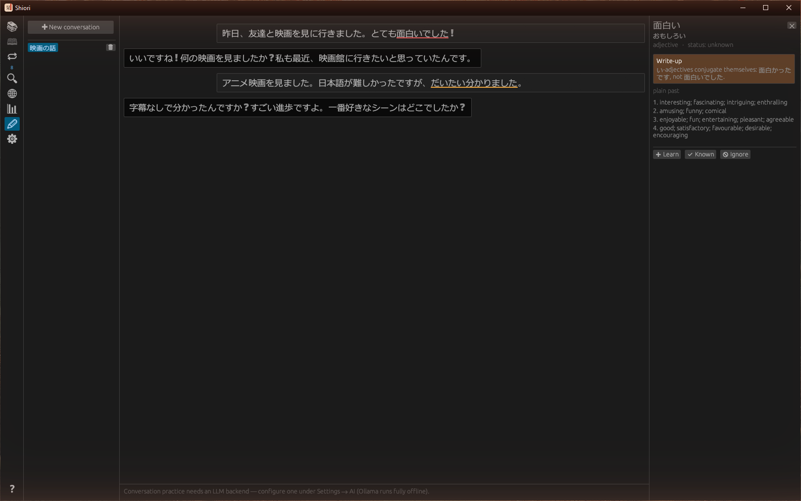
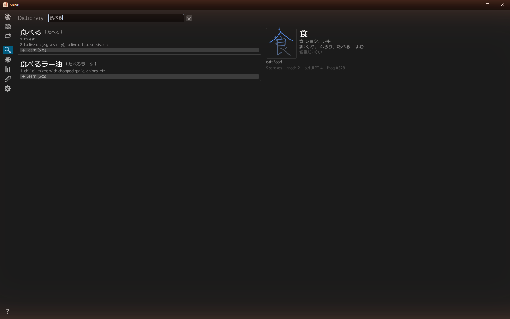
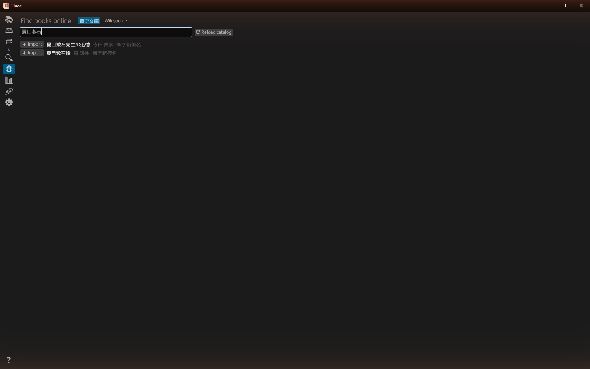
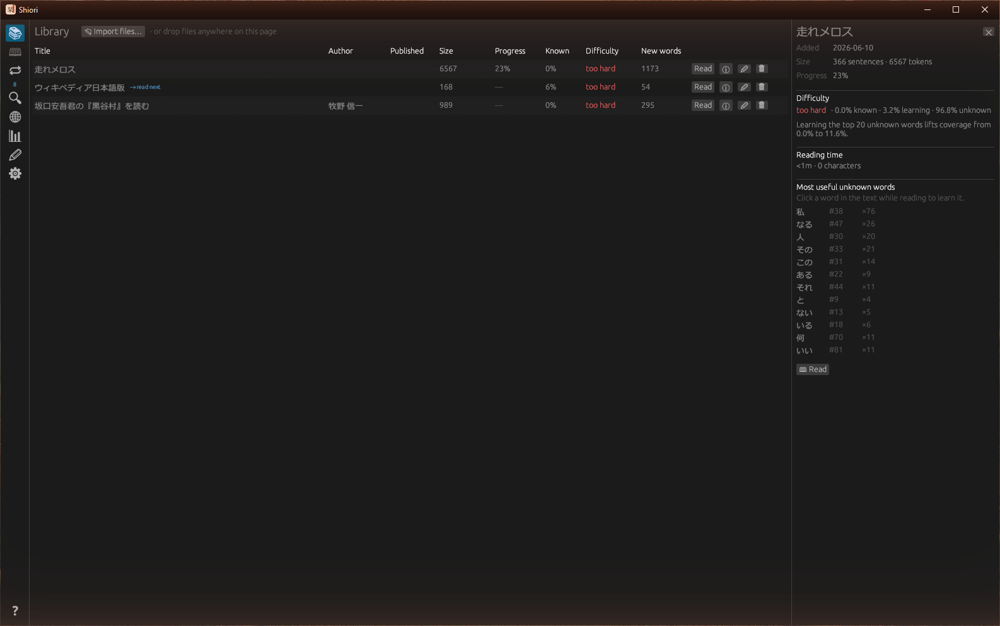
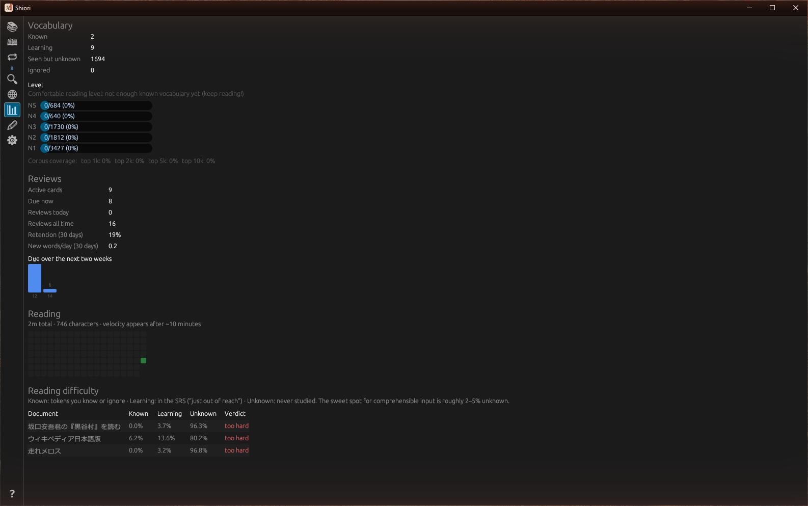

<div align="center">


# Shiori（栞）

**Learn Japanese by actually reading Japanese.**

*Shiori — 栞, "bookmark" — is a desktop reading companion built around
comprehensible input: the primary activity is reading real Japanese text,
and every other feature exists to support that.*

[](https://github.com/PeterDessev/Shiori/actions/workflows/ci.yml)
[](LICENSE-MIT)
[](#getting-started)



</div>

---

Import any book. Read it. Click the words you don't know — Shiori shows the
dictionary entry, the usage register, the conjugation explained piece by
piece — and one click later the word is in spaced repetition, anchored to
the exact sentence you found it in. The app tracks every word you've ever
met, grades each book in your library against what you know, and tells you
what to read next.

No accounts, no subscription, no cloud. One executable and a folder of
SQLite.

Japanese is where Shiori lives, but it no longer reads Japanese alone —
whole languages arrive as [data packs](#whole-languages-as-data), from
corpus-first Koine Greek to ~19 modern languages built from Wiktionary.

## The interesting parts

### A reader that knows what you don't

Furigana appears only over words you haven't learned — and in its
strictest mode, only over the **first few occurrences of each word per
book**, anchored to those exact spots: scaffolding that fades as you read
deeper. Unknown words get a subtle tint. Clicking a conjugated verb selects
the whole phrase (読んでいる, not 読) and explains the form component by
component.



The reading clock is honest: pages you flip through in under a fifth of the
expected time don't count, the app pauses itself when you wander off (with
a five-second grace period for genuinely hard pages), and your reading
velocity in characters per minute feeds everything from away detection to
the statistics page.

### Conversation practice that doesn't interrupt

Chat with a native-speaker persona that **converses with you — it never
corrects you mid-conversation**. Instead, your messages come back marked up
like a paper: red underlines for grammar errors, orange for phrasing a
native wouldn't use, with the explanation one hover away. Every word in the
chat is clickable, just like the reader.



Bring your own brain: Anthropic's API, **any local model through Ollama**
(pull models from inside the app; nothing leaves your machine), or any
OpenAI-compatible endpoint. A challenge dial sets whether the partner
matches your level, pushes slightly above it, or goes full native.

### A dictionary with stroke order built in

Search JMdict by kanji, kana, or any word form. Every kanji in your query
gets a card: readings, meanings, school grade, and an animated stroke-order
diagram drawn from KanjiVG data — scroll to scrub it stroke by stroke. Add
any hit straight to spaced repetition from the search results.



### Books from the internet, one click away

Book search is per-language. Switch the active language right in the
window and search **that language's** free libraries: its **Wikisource**
wiki, **Project Gutenberg** (via the Gutendex API, filtered to the
language), and — for Japanese — **Aozora Bunko**'s 17,000+ public-domain
works (Shift_JIS, ruby markup and all; the catalog is cached after the
first fetch so later searches run locally and instantly). Add your own
**OPDS** distributors per language to search any compatible catalog
(OPDS 1.x and 2.0, with OpenSearch), and browse a bundled directory of
free, legal collections for the language under the **Libraries** tab.
Everything imports straight into your library under the active language.



### Whole languages as data

Japanese is built in; every other language is a
[language pack](docs/wiki/Language-Packs.md) — data, not code. Settings →
Languages activates a language, installs packs from a folder, a zip, or a
URL (with optional SHA-256 verification), imports a pack's bundled texts,
and removes packs — all live, no restart, and nothing mixes across
languages.

Two ways a language gets there. **Koine Greek** ships corpus-first: every
word of its MorphGNT-derived texts carries a hand-verified parse, the
furigana slot doubles as an interlinear gloss, the word panel decodes each
parse to prose, and the statistics grade you against GNT frequency tiers —
search is accent-insensitive and accepts betacode and Greeklish. **Build
from Wiktionary** compiles any of ~19 modern languages on your machine
from kaikki.org's Wiktextract data and hermitdave's frequency lists:
inflection tables become the grammar, frequency is lemmatized into
Top-500/1k/2k/5k tiers, senses keep their register labels, IPA is a
setting away, and the gigabyte-class downloads resume instead of
restarting.

Pack languages get real analysis without a morphological engine.
Dictionary search resolves inflected forms — *suis* finds both être and
suivre, with everyday words ranked above rare homographs — contractions
are pack data (au reads as à + le, components clickable), Germanic packs
split unknown compounds against their own dictionary, and a candidate
picker in the reader re-points any ambiguous occurrence with one click.
Production practice follows the language too: pack-defined personas (dead
languages disclose the synthetic persona), composition exercises,
translation drills built from your own reading, and per-language model
overrides. The
[languages guide](https://PeterDessev.github.io/Shiori/docs/languages/)
covers the details.

<details>
<summary><b>More screenshots</b> — library with per-book analytics, statistics that change behavior</summary>

#### Library
Every book shows your progress, known-word share, and difficulty verdict.
The info panel adds a coverage forecast ("learning the top 20 unknown words
lifts coverage from 87% to 95%"), your reading time, and the most useful
unknown words. Finish a book and one click promotes every word still marked
unknown to **known** (proper nouns become **ignored**) — with rare or
out-of-band words flagged for you to confirm before the sweep, so a stray
"known" never inflates your stats.



#### Statistics that change behavior

Reading velocity and a reading calendar, a comfortable-reading-level grade
against JLPT vocabulary lists, review forecasts, true retention, and
per-book difficulty — the numbers that actually tell you what to do next.
Every number follows the active language, so Greek reviews never blur
your Japanese retention.



</details>

## Everything else

- **FSRS spaced repetition** — cards always show the word inside the
  sentence you found it in, framed by its neighbors, plus example sentences
  from your other books.
- **Anki interop** — export your cards with scheduling, or import an
  existing deck (SM-2 state seeds FSRS).
- **Four knowledge statuses** — unknown / learning / known / ignored, so
  names and noise never pollute your stats.
- **Press-to-record shortcuts** with modifier combos, dark/light/sepia
  themes, gothic or mincho Japanese fonts, adjustable reader typography.
- **A home page** — the app opens on the active language with a quick
  switcher, cards due today with a time estimate from your measured review
  pace, a pick-up-where-you-left-off card (progress, time left at your
  reading speed, unknown words ahead), and the reading calendar.
- **Offline-first** — after the first-run data download everything except
  LLM calls, online search, and language-pack downloads works without a
  network; once a pack is installed or built, it works fully offline. Your
  data is one SQLite file with one-click backup and restore, and your
  settings export to a single JSON.
- **Import anything** — `.txt`, `.md`, `.html` (Aozora), `.epub`, `.pdf`,
  UTF-8 or Shift_JIS, by file dialog or drag-and-drop.

## Getting started

**Download** — grab the build for your platform from
[Releases](https://github.com/PeterDessev/Shiori/releases) and run it:

| Platform | Asset | Run |
|---|---|---|
| Windows x86_64 | `shiori-*-windows-x86_64.zip` | unzip, run `shiori.exe` |
| Linux x86_64 | `shiori-*-linux-x86_64.tar.gz` | extract, run `./shiori` |
| macOS (Apple Silicon) | `shiori-*-macos-aarch64.tar.gz` | extract, run `./shiori` |
| macOS (Intel) | `shiori-*-macos-x86_64.tar.gz` | extract, run `./shiori` |

Each archive carries the licenses, README, and changelog next to the
binary. On first launch the app downloads its Japanese reference data
(JMdict, frequency list, kanji data with stroke order, JLPT lists — ~20 MB
total) and you're reading; other languages arrive as packs from Settings →
Languages.

Platform notes:
- **Windows** — statically linked against the MSVC CRT; runs on stock
  Windows 10/11 with no VC++ Redistributable.
- **Linux** — needs a desktop with OpenGL, `xdg-desktop-portal` for the
  open/save dialogs (standard on GNOME/KDE), and a CJK font for Japanese
  text (install `noto-cjk`, e.g. `sudo apt install fonts-noto-cjk`); Noto
  is also downloadable in-app from Settings.
- **macOS** — the binary is unsigned, so the first launch needs a
  right-click → Open (or *System Settings → Privacy & Security → Open
  Anyway*) to get past Gatekeeper.

CI builds and tests every commit on all three platforms, and each release
ships binaries for all of them.

**Build from source**:

```sh
cargo build --release -p shiori-gui   # first build embeds the IPADIC
./target/release/shiori               # dictionary and needs network, once
```

Building needs a recent stable Rust toolchain (CI builds on `stable`). The
first build downloads and embeds the IPADIC morphological dictionary, so it
needs network access once and takes a few minutes.

**Learn more** — the
[user guide](https://PeterDessev.github.io/Shiori/docs/) covers every
feature:
[Getting Started](https://PeterDessev.github.io/Shiori/docs/getting-started/) ·
[Reading](https://PeterDessev.github.io/Shiori/docs/reading/) ·
[Reviews & SRS](https://PeterDessev.github.io/Shiori/docs/reviews-and-srs/) ·
[Dictionary & Kanji](https://PeterDessev.github.io/Shiori/docs/dictionary-and-kanji/) ·
[Online Sources](https://PeterDessev.github.io/Shiori/docs/online-sources/) ·
[AI & Chat](https://PeterDessev.github.io/Shiori/docs/ai-and-chat/) ·
[Languages](https://PeterDessev.github.io/Shiori/docs/languages/) ·
[Statistics](https://PeterDessev.github.io/Shiori/docs/statistics/) ·
[Data & Interop](https://PeterDessev.github.io/Shiori/docs/data-and-interop/) ·
[Architecture](https://PeterDessev.github.io/Shiori/docs/architecture/)

## Roadmap & non-goals

The [roadmap](ROADMAP.md) is an issue-style tracker of accepted work —
planned, in progress, done. As of the 0.3.0 release it holds two small UI
items: better Markdown rendering in the reading view, and more consistent
scroll bars. Two longer-standing deferrals sit outside it: an **NHK Easy
News** source waits on a usable article index, and **text-to-speech** is
planned in stages, ending in optional local
[VOICEVOX](https://voicevox.hiroshiba.jp/). One hard non-goal: **no
embedded LLM inference engine, ever** — local AI is delegated to Ollama or
any OpenAI-compatible server you point Shiori at.

## Troubleshooting & getting help

Found a bug or have a question? Open an issue on the
[tracker](https://github.com/PeterDessev/Shiori/issues). A couple of known rough
edges worth knowing up front:

- KanjiVG stroke-order data covers only about half of the kanji in
  KANJIDIC2, so rarer characters fall back to a plain large glyph with no
  stroke-order diagram.
- Conversation practice, online search, and language-pack downloads
  (install-from-URL and Build-from-Wiktionary) are the only features that
  reach the network after first run; everything else — installed packs
  included — works fully offline.

## Contributing

Contributions are welcome. [CONTRIBUTING.md](CONTRIBUTING.md) covers
development setup, the test suite, and the commit conventions (atomic
conventional commits). The codebase is a Cargo workspace split by concern:

| Crate          | Concern                                                  |
|----------------|----------------------------------------------------------|
| `shiori-core`  | Shared domain types and errors                           |
| `shiori-lang`  | The `LanguageService` abstraction every language implements |
| `shiori-nlp`   | Japanese morphological analysis (Lindera/IPADIC)         |
| `shiori-pack`  | Data-driven language packs: manifests, SIAT annotated texts |
| `shiori-packc` | CI pack compiler (MorphGNT, kaikki/Wiktextract inputs)   |
| `shiori-srs`   | FSRS spaced-repetition scheduler                         |
| `shiori-dict`  | JMdict, KANJIDIC2/KanjiVG, JLPT, frequency data          |
| `shiori-db`    | SQLite persistence, Anki .apkg read/write                |
| `shiori-app`   | Application services: ingestion, reviews, stats, sources |
| `shiori-llm`   | LLM backends: Anthropic, Ollama, OpenAI-compatible       |
| `shiori-gui`   | egui desktop interface                                   |

## Data sources

Shiori ships no dictionary data; it downloads everything on first run —
or when you install or build a language pack:

- [JMdict](https://www.edrdg.org/jmdict/j_jmdict.html) and
  [KANJIDIC2](https://www.edrdg.org/wiki/index.php/KANJIDIC_Project) —
  © the [EDRDG](https://www.edrdg.org/), used under the
  [EDRDG licence](https://www.edrdg.org/edrdg/licence.html) (CC BY-SA);
  JMdict fetched via
  [jmdict-simplified](https://github.com/scriptin/jmdict-simplified).
- [KanjiVG](https://kanjivg.tagaini.net/) stroke-order data — © Ulrich
  Apel, CC BY-SA 3.0.
- JLPT vocabulary lists —
  [stephenmk/yomitan-jlpt-vocab](https://github.com/stephenmk/yomitan-jlpt-vocab)
  (CC BY-SA 4.0, over Jonathan Waller's CC BY data).
- Word frequency — Leeds Internet Corpus derived list (CC BY).
- [MorphGNT](https://github.com/morphgnt/sblgnt) annotations (CC BY-SA)
  over the SBLGNT (CC BY 4.0) — the Koine Greek pack.
- [kaikki.org](https://kaikki.org/) Wiktextract data (CC BY-SA 4.0 & GFDL)
  and
  [hermitdave's FrequencyWords](https://github.com/hermitdave/FrequencyWords)
  lists (CC BY-SA 4.0) — packs built from Wiktionary.
- [Noto Sans JP / Noto Serif JP](https://fonts.google.com/noto) fonts
  (SIL Open Font License 1.1) — downloaded on first use.
- Books — [Aozora Bunko](https://www.aozora.gr.jp/) (public domain, Japanese),
  the per-language [Wikisource](https://wikisource.org/) wikis,
  [Project Gutenberg](https://www.gutenberg.org/) via the
  [Gutendex](https://gutendex.com/) API, and any user-added
  [OPDS](https://opds.io/) distributor. The bundled `Libraries` directory
  of free, legal collections is compiled from public catalog metadata.

Settings → General gathers every attribution in one place, plus the
license line of each installed pack.

## License

Dual-licensed under [MIT](LICENSE-MIT) or [Apache-2.0](LICENSE-APACHE), at
your option.
